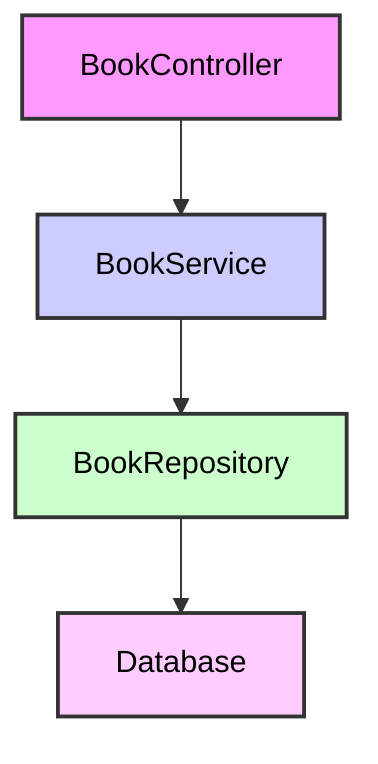
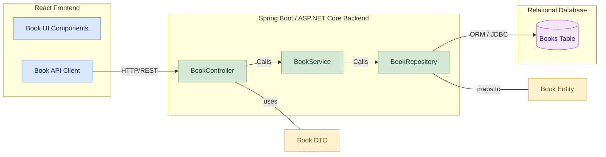
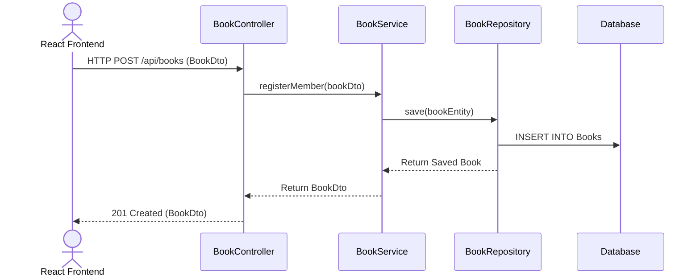

# Book Management Service

- The Book Management Service is a microservice responsible for handling all book-related operations in the Library Management System. It supports adding, updating, deleting, and retrieving book records. The service is independently deployable and integrated via Eureka Discovery and Spring Cloud Gateway.

---

 Functional Scope
- Add new books to the library
- Update book information (title, author, genre, etc.)
- Delete books from the system
- Retrieve books by ID or search by title
- Manage available copies for borrowing

---

 Technology Stack

| Layer              | Technology             |
|--------------------|------------------------|
| Language           | Java 17+               |
| Framework          | Spring Boot 3.x        |
| REST API Docs      | Springdoc OpenAPI      |
| ORM & Persistence  | Spring Data JPA        |
| Database           | MySQL                  |
| Service Discovery  | Eureka                 |
| API Gateway        | Spring Cloud Gateway   |

---
Architechture Diagram

Component diagram


Sequence Diagram


 
---

##  REST API Endpoints

| Method | Endpoint           | Description                |
|--------|--------------------|----------------------------|
| POST   | `/api/books`       | Add a new book             |
| PUT    | `/api/books/{id}`  | Update existing book       |
| DELETE | `/api/books/{id}`  | Delete book by ID          |
| GET    | `/api/books`       | List or search books       |
| GET    | `/api/books/{id}`  | Get book details by ID     |

Swagger Url : http://localhost:8081/swagger-ui/index.html#/

---

 Data Model

 `Book` Entity

| Field            | Type     | Description                    |
|------------------|----------|--------------------------------|
| bookId           | BIGINT   | Primary key, auto-generated    |
| title            | VARCHAR  | Book title                     |
| author           | VARCHAR  | Author name                    |
| genre            | VARCHAR  | Book genre/category            |
| isbn             | VARCHAR  | Unique book identifier         |
| yearPublished    | INTEGER  | Year of publication            |
| availableCopies  | INTEGER  | Number of copies available     |


Service Layer
Responsible for:
- Validating book data and ISBN uniqueness
- CRUD operations for books
- Business logic for availability tracking


Controller Layer
Responsible for:
- Handling all public HTTP endpoints
- Validating input via DTOs
- Delegating to the service layer
- Returning appropriate HTTP responses


Service Discovery
Service is registered with Eureka under:

```properties
spring.application.name=book-service
